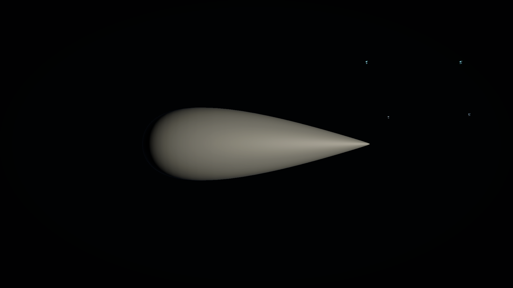
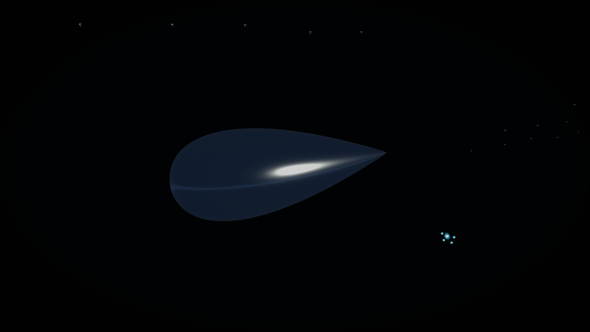
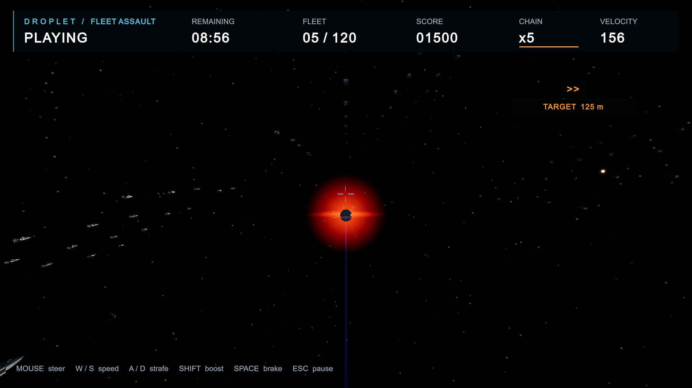

# 三体水滴 Unity 导入与测试 — 2026-09-08

已将上一轮的 PerfectDroplet 游戏 FBX 实际导入 Unity，保存可复用视觉 Prefab，并在现有关卡的独立副本中替换水滴网格。编译、专项 EditMode 3/3、PlayMode 2/2 和实际 FixedUpdate 飞行检查通过。

试玩打开 `Assets/_Project/Scenes/FleetAssault_PerfectDroplet_Test.unity`，按 Play，点击 Game 窗口后按 Enter。编辑器交付时已打开该场景、退出 Play，场景无未保存修改。

## 实际交付与改动

| 文件 | 用途 |
|---|---|
| `Assets/_Project/Art/Models/PerfectDroplet/PerfectDroplet_Game.fbx` | 游戏网格，保留 Blender 导出字节 |
| `Assets/_Project/Prefabs/Player/PerfectDropletVisual.prefab` | 可复用纯视觉 Prefab，引用新模型和已有 MetalDroplet 材质 |
| `Assets/_Project/Scenes/FleetAssault_PerfectDroplet_Test.unity` | 从 FleetAssault_Lighting 通过 Editor API 复制并保存的可玩测试场景 |
| `Assets/_Project/Scripts/Editor/PerfectDropletImport.cs` | 明确执行的导入、检查、场景复制、截图和运行检查菜单 |
| `Assets/_Project/Tests/EditMode/PerfectDropletImportTests.cs` | 3 项导入、保全和重导入引用测试 |
| `Assets/_Project/Tests/PlayMode/PerfectDropletPlayTests.cs` | 2 项运动、扫掠、暂停、胜利及重开测试 |
| `docs/verification/PerfectDropletUnity/` | 原始 JSON、9 张实际 Unity 截图、任务前哈希及关键文件备份 |
| `docs/STATUS.md`、`docs/ENVIRONMENT.md` | 本轮状态与实际环境记录 |

以上 Assets 均由 Unity 创建对应 `.meta`。原 Blender 源、导出和几何交付包继续使用上一轮文件，详见 [几何报告](DROPLET_GEOMETRY_REPORT.md)。本轮无模型重建或新 LOD。

测试场景保留原视觉节点的 Transform、MeshRenderer、材质和所有行为引用，只替换 MeshFilter.sharedMesh。保留 120 舰、1,080 个 Collider、540 秒、原相机、计分与运动参数。视觉 Prefab 独立交付，场景直接引用同一导入网格，避免破坏原 Renderer 的特效引用。

## 导入结果

| 项目 | Unity 实测 |
|---|---|
| 尺寸 X / Y / Z | 0.774193525 / 0.774193525 / 2.400000095 m |
| 长度 : 最大直径 | 3.1 : 1 |
| 网格 / 三角形 / Unity 顶点 | 1 / 5,632 / 2,983 |
| 轴、原点与变换 | 尖端 +Z，上方 +Y；包围盒中心原点；位置及旋转 0，缩放 1；无残留轴校正父变换 |
| 法线 | Import Normals；无坏法线、反向三角形或零面积三角形；同位置拆分顶点法线角差最大 0° |
| 导入设置 | Bake Axis Conversion；单位缩放；关闭网格压缩、Read/Write、动画、自动 Collider 及材质导入 |
| 切线 | Unity MikkTSpace 计算，保留原 UV |
| 既有校准资产 | 1 m 立方体及非对称 +Z / +Y / +X 标记只读检查通过 |

Unity 的 2,983 个顶点包含 UV/切线边界拆分；Blender 源为 2,818 个焊接顶点、2,816 个四边面，三角形预算没有增加。导入保留解析平滑法线，避免重新按面平均引入端部或环线阴影变化。

FBX SHA-256：`d5984085aa89ccb2a939d7fe9c237343e120f6aa08e955e763c1a910205a2445`。原始结果见 [import.json](verification/PerfectDropletUnity/import.json) 和 [scene.json](verification/PerfectDropletUnity/scene.json)。

## 已执行验证

| 检查 | 结果与证据 |
|---|---|
| 实际 Unity 编译 | completed，failed=false，errors=[]；结束时已就绪，近期捕获错误为 0。见 [editor-final.json](verification/PerfectDropletUnity/editor-final.json) |
| 专项 EditMode | 3/3，通过；检查尺寸/轴/法线、新旧场景玩法和舰队一致，以及重导入后 GUID、Mesh local ID、Prefab 引用保留。见 [editmode-result.json](verification/PerfectDropletUnity/editmode-result.json) |
| 专项 PlayMode | 2/2，通过；连续前 5 舰运动、暂停与视觉跟随；120 舰扫掠胜利及 3 次全流程重开。见 [playmode-result.json](verification/PerfectDropletUnity/playmode-result.json) |
| 实时运行输入检查 | 临时 Input System 键鼠事件驱动真实 FixedUpdate，连续飞行 528.438 m / 4.860 s，最大 156 m/s，5 舰、1,500 分；暂停/刹车/转向/重开通过；池对象 57 → 57。见 [live-flight.json](verification/PerfectDropletUnity/live-flight.json) |
| 视觉检查 | 3 个既有镜面材质视角、2 个临时中性材质视角、4 张 Game 状态截图，均实际渲染为 1920×1080 并查看 |
| 既有文件保全 | 758/758 个任务前 Assets / Packages / ProjectSettings / ArtSource / Tools 文件 SHA-256 一致，0 缺失。见 [preservation.json](verification/PerfectDropletUnity/preservation.json) |

PlayMode 的全 120 舰测试在每艘舰船前设置测试起点，再用 DropletMotor 分段扫掠贯穿，验证真实命中/计分/胜利逻辑；它不是连续人工航线。另一次五舰实时飞行没有沿途传送。所有自动输入仅用于检查，不代表用户物理键鼠的主观手感验收。

首次 EditMode 工具请求超时，后续查询确认实际测试已完成并取得 3/3 原始结果。动态 eval 受到既有 Roslyn Illegal byte sequence 问题影响，因此实际写入使用已编译 Editor 菜单。没有运行会重写 TestRange 的旧 SceneAuthoringTests。

## 画面与限制

在本次视角和分辨率下，中性侧视轮廓及镜面高光连续，没有观察到明显法线接缝或局部波浪。既有环境反射较暗，窄亮带来自已有材质/环境；这是导入兼容性检查，不是新的材质或灯光制作。截图时临时改变相机取景和中性材质，完成后恢复；没有写回这些临时配置。

- 原水滴显示宽度约 1.2 m，本模型为 0.774194 m；命中扫掠半径仍为 0.7 m，大于新外形半径约 0.3871 m。保留原命中容错，未做贴身碰撞调参。
- 原追尾相机主要看到饱满圆端，正常前飞时轮廓接近圆形；侧向近景可确认泪滴外形。未改变相机来强化造型展示。
- 未新增太阳光、反射探针、着色器、飞船或特效；实际关卡截图包含既有内容。
- 未生成本轮 Windows 独立构建，旧可执行文件仍是旧模型。未做 Player 性能、GPU/显存、跨硬件、长时间完整航线或物理键鼠主观验收；本轮结论限于实际 Editor 导入与运行测试。
- 没有阻碍本场景试玩的未解决错误。历史 TestRange 更早版本保全问题仍以原报告为准；本轮开始时的 TestRange 字节保持不变。

## 用户复查

1. 打开 `FleetAssault_PerfectDroplet_Test`，Play 后聚焦 Game 并按 Enter 开始。
2. 鼠标转向，W/S 调速，Shift 冲刺，Space 刹车，A/D 横移；确认水滴模型与运动一致。
3. 贯穿目标后检查舰数和分数；Esc 暂停，R 重开，预期恢复 120 舰、09:00、0 分和新水滴。
4. 需要近景时退出 Play，查看视觉 Prefab，或在本测试场景执行 `DropletPrototype > Perfect Droplet > 3 Capture Model Views`。已有场景不必重新生成；生成菜单会拒绝覆盖已有成果。
5. 复跑测试只筛选 `PerfectDropletImportTests`（EditMode）和 `PerfectDropletPlayTests`（PlayMode）。自动实时输入检查在本场景 Play 中执行菜单 `4 Live Flight Check`，会重置当前测试局。

停在水滴导入与测试交付；下一步仅由用户试玩确认，不自动开展材质升级、灯光或爆炸开发。
